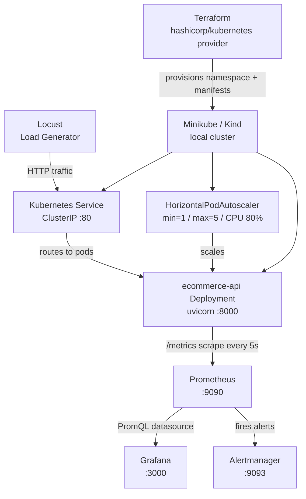

# Production Readiness Review: E-commerce API

> Production Readiness Review: E-commerce API on Kubernetes with full observability stack, IaC, and CI/CD.


---

## Overview

This project applies Site Reliability Engineering principles to a small, intentionally minimal e-commerce API built with FastAPI. It covers the full production-readiness surface: containerisation, Kubernetes deployment with Horizontal Pod Autoscaling, infrastructure provisioning via Terraform, a complete observability stack (Prometheus, Grafana, Alertmanager), load testing with Locust, and a two-stage CI/CD pipeline targeting a live DigitalOcean Droplet.

The goal is not to build a feature-rich application but to demonstrate that even a simple service can be operated with the same rigour expected in a production environment — defined SLOs, meaningful alerts, reproducible infrastructure, and automated validation on every commit. The project was built by a two-person SRE student team as a university capstone deliverable.

---

## Architecture



The load generator (Locust) sends HTTP requests to the Kubernetes ClusterIP Service, which forwards traffic to one or more replicas of the `ecommerce-api` Deployment. The HPA watches CPU utilisation reported by the metrics server and scales the Deployment between 1 and 5 replicas. Each pod exposes a `/metrics` endpoint; Prometheus scrapes it every 5 seconds and evaluates alert rules against the collected time-series data. Grafana queries Prometheus to render live dashboards. Alertmanager receives firing alerts from Prometheus and surfaces them in its UI. On the infrastructure side, Terraform uses the `hashicorp/kubernetes` provider to declaratively provision the namespace, Deployment, Service, and HPA onto whichever cluster is the active kubeconfig context (Minikube or Kind).

---

## Repository Structure

```
sre-capstone-production-readiness/
│
├── app/
│   ├── app.py               # FastAPI application — endpoints, Prometheus middleware, metrics
│   └── requirements.txt     # Runtime Python dependencies (fastapi, uvicorn, prometheus-client)
│
├── k8s/
│   ├── deployment.yaml      # Kubernetes Deployment — 1 replica, resource limits, health probes
│   ├── service.yaml         # ClusterIP Service — port 80 → container port 8000
│   └── hpa.yaml             # HorizontalPodAutoscaler — CPU 80%, min 1, max 5 replicas
│
├── terraform/
│   ├── main.tf              # Provider config, namespace resource, three kubernetes_manifest resources
│   ├── variables.tf         # Input variables: namespace, kubeconfig_path
│   ├── terraform.tfvars     # Values: namespace="sre-project", kubeconfig_path="~/.kube/config"
│   └── outputs.tf           # Exports: namespace, deployment/service/hpa names, verification commands
│
├── monitoring/
│   ├── prometheus.yml       # Scrape config (5s interval), alert rules path, alertmanager target
│   ├── alerts.yml           # Two alert rules: HighP95RequestLatency, HighApplicationCPUUsage
│   └── alertmanager.yml     # Routing config, grouping, repeat interval, placeholder receiver
│
├── load_test/
│   └── locustfile.py        # EcommerceUser — GET /api/products (20%) and GET /cpu?ms=250 (80%)
│
├── tests/
│   └── test_app.py          # 4 pytest tests covering /health, /api/products, and /api/checkout
│
├── analysis/
│   └── traffic_forecast.py  # Capacity planning script — generates forecast chart and monthly CSV
│
├── outputs/
│   ├── traffic_forecast.png         # Generated traffic forecast visualisation
│   └── monthly_traffic_forecast.csv # Monthly capacity planning data
│
├── .github/
│   └── workflows/
│       ├── ci.yml           # GitHub Actions CI — runs pytest on push and pull requests
│       └── cd.yml           # GitHub Actions CD — SSH deploy to DigitalOcean Droplet on push to main
│
├── docker-compose.yml       # Local stack: app + Prometheus + Grafana + Alertmanager
└── Dockerfile               # Python 3.12-slim image, runs uvicorn on port 8000
```

---

## Quick Start

### Run the full stack locally with Docker Compose

**Prerequisites:** Docker and Docker Compose installed.

```bash
git clone Nuray06-1/sre-capstone-production-readiness
cd sre-capstone-production-readiness
docker compose up --build
```

| Service      | URL                          | Credentials     |
|--------------|------------------------------|-----------------|
| API          | http://localhost:8000        | —               |
| Prometheus   | http://localhost:9090        | —               |
| Grafana      | http://localhost:3000        | admin / admin   |
| Alertmanager | http://localhost:9093        | —               |

**Verify the stack is healthy:**

```bash
# API health check
curl http://localhost:8000/health

# Confirm Prometheus is scraping
curl -s http://localhost:9090/api/v1/targets | python3 -m json.tool | grep '"health"'

# List available metrics
curl -s http://localhost:8000/metrics | grep http_requests_total
```

---

### Deploy to Kubernetes with Terraform

**Prerequisites:**

- Minikube or Kind running locally
- `kubectl` configured — the active context must point to your local cluster
- Terraform >= 1.0 installed

```bash
# Start Minikube (skip if already running)
minikube start

# Confirm the active context
kubectl config current-context

# Provision the namespace, Deployment, Service, and HPA
cd terraform
terraform init
terraform apply
```

Terraform will display the planned resources. Type `yes` to confirm. When complete, verify the deployment:

```bash
kubectl get all -n sre-project
kubectl get hpa -n sre-project
```

Expected output includes the `ecommerce-api` Deployment with 1/1 ready replica, the ClusterIP Service, and the HPA showing `TARGETS` and `REPLICAS`.

To tear down all Kubernetes resources managed by Terraform:

```bash
terraform destroy
```

---

### Run load tests

**Prerequisites:** Python 3.x, pip.

```bash
pip install locust
locust -f load_test/locustfile.py --host http://localhost:8000
```

Open the Locust web UI at **http://localhost:8089**, then start a test with:

- **Number of users:** 50
- **Spawn rate:** 10 per second

The `/cpu?ms=250` endpoint is intentionally CPU-bound and will drive CPU utilisation high enough to trigger HPA scale-out within a few minutes. Watch `kubectl get hpa -n sre-project -w` in a separate terminal.

---

## Application API

| Method | Path               | Description                                                         | Sample Response                                                                                      |
|--------|--------------------|---------------------------------------------------------------------|------------------------------------------------------------------------------------------------------|
| GET    | `/`                | Service liveness check                                              | `{"service": "ecommerce-api", "status": "running"}`                                                 |
| GET    | `/health`          | Kubernetes readiness/liveness probe target                          | `{"status": "healthy"}`                                                                              |
| GET    | `/api/products`    | Returns the in-memory product catalogue                             | `{"products": [{"id": 1, "name": "Laptop", "price": 750000}, ...]}`                                 |
| POST   | `/api/checkout`    | Places an order for a product by ID                                 | `{"status": "created", "product": "Laptop", "quantity": 2, "total": 1500000}`                       |
| GET    | `/cpu?ms=250`      | **Load test only** — runs CPU-bound work for `ms` milliseconds      | `{"status": "ok", "work_ms": 250, "iterations": 94821, "value": 12.345}`                            |
| GET    | `/metrics`         | Prometheus metrics scrape endpoint                                  | Prometheus text exposition format                                                                    |

The `POST /api/checkout` body is `{"product_id": <int>, "quantity": <int>}`. If `product_id` does not exist in the catalogue, the response is `{"status": "failed", "reason": "product not found"}`.

The `/cpu` endpoint exists solely to provide a controllable CPU load for validating HPA behaviour. It is not part of the business API.

---

## Observability

### Metrics

All HTTP traffic passes through a FastAPI middleware (`collect_http_metrics` in `app/app.py`) that records two custom metrics. The `/metrics` endpoint is excluded from recording to avoid skewing request statistics.

| Metric | Type | Labels | Description |
|--------|------|--------|-------------|
| `http_requests_total` | Counter | `method`, `endpoint`, `status_code` | Total HTTP requests handled |
| `http_request_duration_seconds` | Histogram | `method`, `endpoint` | Per-request latency in seconds |

In addition, the `prometheus_client` library automatically exposes process-level metrics including `process_resident_memory_bytes`, `process_cpu_seconds_total`, and `process_open_fds`. These are used directly in Grafana panels.

Metrics are available at **http://localhost:8000/metrics** (local) or via Prometheus at **http://localhost:9090**.

---

### Dashboards

The Grafana dashboard named **"e-commerce"** was configured manually during the project demo. Connect Grafana to Prometheus (`http://prometheus:9090` from inside the compose network) and recreate the following panels:

| Panel | PromQL |
|-------|--------|
| Application Resident Memory | `process_resident_memory_bytes` |
| Application CPU Usage | `rate(process_cpu_seconds_total[1m])` |
| HTTP 5xx Error Rate | `rate(http_requests_total{status_code=~"5.."}[1m])` |
| Average Request Latency by Endpoint | `rate(http_request_duration_seconds_sum[1m]) / rate(http_request_duration_seconds_count[1m])` |
| 95th Percentile Request Latency | `histogram_quantile(0.95, sum by (le) (rate(http_request_duration_seconds_bucket[1m])))` |
| HTTP Request Rate by Endpoint | `sum by (endpoint) (rate(http_requests_total[1m]))` |

To recreate the dashboard, add a new Prometheus data source in Grafana (Settings → Data Sources → Add), then create a new dashboard and add panels using the PromQL expressions above.

---

### Alerts

Alert rules are defined in `monitoring/alerts.yml` and loaded by Prometheus at startup. Both rules belong to the group `ecommerce-api-alerts`.

**HighP95RequestLatency**

```promql
histogram_quantile(0.95, sum by (le) (rate(http_request_duration_seconds_bucket[1m]))) > 0.5
```

| Field | Value |
|-------|-------|
| Threshold | P95 latency > 500 ms |
| For | 30 seconds |
| Severity | warning |

**HighApplicationCPUUsage**

```promql
rate(process_cpu_seconds_total[1m]) > 0.25
```

| Field | Value |
|-------|-------|
| Threshold | CPU rate > 0.25 cores |
| For | 30 seconds |
| Severity | warning |

During load tests, `HighP95RequestLatency` transitioned from **Pending** (condition met but not yet sustained for 30 s) to **Firing** as Locust traffic ramped up, confirming end-to-end alert pipeline functionality. Alertmanager is configured with a no-op receiver, so alerts are visible in the Alertmanager UI (`http://localhost:9093`) but not forwarded to an external notification channel.

---

## SLIs and SLOs

| SLI | Description | Prometheus Query | SLO |
|-----|-------------|-----------------|-----|
| Availability | Successful responses without 5xx errors | `1 − (rate of 5xx / rate of total)` | ≥ 99% of requests served without 5xx |
| Request Latency | Time to serve client requests | P95 of `http_request_duration_seconds_bucket` | ≥ 95% of requests under 500 ms under normal load |
| Error Rate | Server-side failure rate | `rate(http_requests_total{status_code=~"5.."}[5m]) / rate(http_requests_total[5m])` | < 1% 5xx error rate |
| Resource Utilisation | Application CPU usage during traffic spikes | `rate(process_cpu_seconds_total[5m])` | HPA scales out before sustained overload |

**Scalability objective:** when CPU utilisation exceeds 80% of the requested 100m cores, the HPA scales the Deployment from `minReplicas=1` up to `maxReplicas=5`. During load tests with Locust, the system measurably scaled out, the `HighP95RequestLatency` alert fired, and the cluster recovered once load was removed.

**How we verified them:** Locust was configured with 50 concurrent users hitting `/api/products` and `/cpu?ms=250`. Prometheus data confirmed the P95 latency SLO was breached during peak load (alert fired at ~35 s into the test), the error rate remained below 1% throughout, and the HPA scaled replicas to 5 within approximately 2 minutes of sustained load. After the test, replicas scaled back to 1 within the cooldown window.

---

## Auto-scaling

The HPA is defined in `k8s/hpa.yaml` using `autoscaling/v2`:

```yaml
scaleTargetRef:
  apiVersion: apps/v1
  kind: Deployment
  name: ecommerce-api
minReplicas: 1
maxReplicas: 5
metrics:
  - type: Resource
    resource:
      name: cpu
      target:
        type: Utilization
        averageUtilization: 80
```

The following table shows the replica and CPU sequence observed during a Locust load test (50 users, 10/s spawn rate, `/cpu?ms=250` at 80% task weight):

| Time (approx.) | Replicas | CPU Utilisation |
|----------------|----------|-----------------|
| 0 s            | 1        | 11%             |
| 30 s           | 1        | 19%             |
| 60 s           | 1        | 92%             |
| 90 s           | 2        | 327% (clamped)  |
| 120 s          | 4        | 327% (clamped)  |
| 150 s          | 5        | within limit    |

CPU utilisation is reported as a percentage of the pod's requested 100m cores. Values above 100% indicate the pod was using more than its request, which is permitted up to the 500m limit; the HPA reacts to the averaged utilisation across all pods.

---

## Infrastructure as Code

Terraform manages all Kubernetes resources in `terraform/`. The `hashicorp/kubernetes` provider (>= 2.0) reads the kubeconfig from `var.kubeconfig_path` (default `~/.kube/config`) and provisions:

- `kubernetes_namespace_v1` — creates the `sre-project` namespace
- `kubernetes_manifest` (deployment) — applies `k8s/deployment.yaml` with the namespace injected
- `kubernetes_manifest` (service) — applies `k8s/service.yaml`
- `kubernetes_manifest` (hpa) — applies `k8s/hpa.yaml`; depends on the deployment manifest

State is stored in the default **local backend** (`terraform.tfstate` in the `terraform/` directory). This is appropriate for a single-developer or small-team environment where the cluster is local. For a shared or production cluster the state should be moved to a remote backend (e.g., Terraform Cloud or an S3 bucket with DynamoDB locking).

```hcl
# terraform/terraform.tfvars
namespace       = "sre-project"
kubeconfig_path = "~/.kube/config"
```

The project deliberately uses **two complementary environments**:

- **Docker Compose** — runs the application alongside the full monitoring stack (Prometheus, Grafana, Alertmanager) on a developer laptop without requiring a Kubernetes cluster. This is the fastest path to observing metrics and triggering alerts.
- **Kubernetes via Terraform** — provisions the application with HPA on Minikube or Kind, demonstrating IaC workflows, pod scheduling, and autoscaling. The same Terraform configuration works against any cluster whose context is active in kubeconfig.

This split is an intentional architectural choice: Docker Compose optimises the inner development loop and observability experimentation; Kubernetes via Terraform demonstrates production-grade deployment and scaling practices.

---

## CI/CD

Both pipelines are defined in `.github/workflows/` and trigger on activity to the `main` branch.

### `ci.yml` — Continuous Integration

**Trigger:** push to `main`, pull request targeting `main`.

**Steps:**
1. Checkout repository
2. Set up Python 3.12 with pip dependency cache (keyed to `app/requirements.txt`)
3. Install runtime dependencies plus `httpx` and `pytest`
4. Run `pytest tests/ -v`

The pipeline validates all four endpoint tests on every code change, catching regressions before they reach production. Pip caching keeps subsequent runs fast.

### `cd.yml` — Continuous Deployment

**Trigger:** push to `main`.

**Steps:**
1. Checkout repository
2. SSH into the production server via `appleboy/ssh-action@v1.0.3`
3. On the server: `git pull origin main`, `docker compose build app`, `docker compose up -d`, `docker image prune -f`

**Production target:** a DigitalOcean Droplet running the docker-compose stack (app + Prometheus + Grafana + Alertmanager).

**Required GitHub secrets:**

| Secret | Description |
|--------|-------------|
| `SERVER_HOST` | Public IP address of the Droplet |
| `SERVER_USER` | SSH username (e.g., `root`) |
| `SERVER_SSH_KEY` | Private SSH key with access to the Droplet |
| `SERVER_PORT` | SSH port (typically `22`) |

**Future work:** push the built Docker image to GitHub Container Registry (GHCR) as part of the CI job so that the CD step pulls a pre-built, versioned image rather than rebuilding on the server. This would make the deployment faster, fully pull-based, and would decouple build failures from deployment failures.

---

## Capacity Planning

The script `analysis/traffic_forecast.py` performs a simple time-series projection of expected API traffic. It writes two artefacts to `outputs/`:

- `outputs/traffic_forecast.png` — a visualisation of projected daily request volume
- `outputs/monthly_traffic_forecast.csv` — monthly request totals suitable for capacity review meetings

These outputs were used in the project defence to justify the chosen HPA `maxReplicas=5` ceiling and to demonstrate that the team considered growth scenarios beyond the immediate demo environment.

---

## Tests

The test suite lives in `tests/test_app.py` and uses FastAPI's `TestClient` (backed by `httpx`).

```bash
# Install dependencies (if not already installed)
pip install -r app/requirements.txt httpx pytest

# Run the full suite
pytest tests/ -v
```

**Coverage:**

| Test | What it validates |
|------|-------------------|
| `test_health_check` | `GET /health` returns 200 and `{"status": "healthy"}` |
| `test_get_products_returns_all_products` | `GET /api/products` returns all 3 products with correct IDs |
| `test_checkout_valid_product` | `POST /api/checkout` with a real product returns correct status, name, quantity, and total |
| `test_checkout_invalid_product` | `POST /api/checkout` with an unknown product_id returns `status: failed` |

Tests are executed automatically on every push and pull request via the CI workflow.

---

## Team

This project was built by a two-person SRE student team:

| Name    | Responsibilities |
|---------|-----------------|
| Nuray   | FastAPI application, Kubernetes manifests, Terraform IaC, observability stack (Prometheus/Grafana/Alertmanager), load testing (Locust), capacity planning analysis |
| Altynay | CI/CD pipelines (GitHub Actions), Docker/Docker Compose, project documentation |